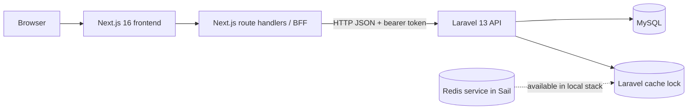

# FishBooker Architecture

Last reviewed: 2026-04-22

## System Summary

FishBooker is a monorepo with two runtime applications:

- `backend/`: Laravel 13 API
- `frontend/`: Next.js 16 application

The current product now covers slot discovery, booking holds, HTTP-only frontend auth trust, payment initiation, payment settlement, finance journaling, and admin reporting.

## Current Architecture

## Backend Modules in Code

### Authentication

- Login endpoint returns a Sanctum token
- `auth/me` returns the current bearer token owner
- `auth/logout` revokes the current token
- Admin authorization is enforced by `EnsureUserIsAdmin`

Key files:

- `backend/app/Http/Controllers/Api/AuthController.php`
- `backend/app/Http/Middleware/EnsureUserIsAdmin.php`
- `backend/routes/api.php`

### Booking and hold lifecycle

- Authenticated booking creation
- Authenticated booking history lookup
- Atomic row lock on the selected slot with `lockForUpdate()`
- Application-level hold using `Cache::lock(...)`
- Automatic cancellation of expired pending holds for the same slot or the current user

Key files:

- `backend/app/Http/Controllers/Api/BookingController.php`
- `backend/app/Services/Bookings/BookingLifecycleService.php`
- `backend/app/Models/Booking.php`

### Payment lifecycle

- Payment creation for a `PENDING` booking
- Reuse of existing pending payment per booking
- Signed manual webhook verification
- Idempotent webhook event storage
- Transition from `PENDING` booking to `SUCCESS` on payment capture
- Cash confirmation flow for admins

Key files:

- `backend/app/Http/Controllers/Api/PaymentController.php`
- `backend/app/Http/Controllers/Api/PaymentWebhookController.php`
- `backend/app/Services/Payments/PaymentService.php`
- `backend/app/Services/Payments/PaymentWebhookService.php`
- `backend/app/Models/Payment.php`
- `backend/app/Models/PaymentWebhookEvent.php`

### Reporting and finance

- Revenue aggregation from finance journals
- Slot occupancy metrics
- Recent transaction feed
- Pending cash payment queue
- CSV export for paid transactions

Key files:

- `backend/app/Http/Controllers/Api/AdminReportingController.php`
- `backend/app/Services/Reporting/AdminReportingService.php`
- `backend/app/Models/FinancialJournal.php`

## Frontend Modules in Code

The frontend now ships:

- one public homepage for discovery and booking
- one payment route
- one booking history route
- one admin dashboard route
- one admin slot management route
- same-origin route handlers that proxy protected backend calls with HTTP-only cookies

Implemented UI pieces:

- `frontend/app/page.tsx`: homepage and public slot fetch
- `frontend/app/bookings/page.tsx`: authenticated booking history route entry
- `frontend/app/payments/[reference]/page.tsx`: payment route entry
- `frontend/app/admin/dashboard/page.tsx`: admin analytics route entry
- `frontend/app/admin/slots/page.tsx`: admin slot management route entry
- `frontend/app/api/**/*`: Next.js BFF route handlers
- `frontend/components/AuthHeader.tsx`: login dialog and session display
- `frontend/components/SlotCard.tsx`: slot detail and booking-to-payment flow
- `frontend/features/bookings/components/BookingHistoryPageClient.tsx`
- `frontend/features/payments/components/PaymentPageClient.tsx`
- `frontend/features/admin-dashboard/components/AdminDashboardPageClient.tsx`
- `frontend/features/admin-slots/components/AdminSlotsPageClient.tsx`
- `frontend/lib/server/auth-cookies.ts`: signed HTTP-only cookie helpers
- `frontend/lib/server/backend-api.ts`: backend proxy fetch helper
- `frontend/proxy.ts`: request-time route protection for admin, booking, and payment pages

## Runtime Flow

### Login and route trust

1. User submits login credentials to a Next.js same-origin route handler.
2. The route handler calls `POST /api/v1/auth/login` on Laravel.
3. Next.js stores the bearer token in an HTTP-only cookie.
4. Next.js stores a signed HTTP-only auth context cookie containing only route-gating data.
5. `proxy.ts` and server routes trust the signed auth context cookie for UX gating.
6. Laravel Sanctum remains the final authority for every protected backend request.

### Create booking hold

1. User selects a slot and confirms booking from the homepage.
2. The frontend calls a same-origin booking route handler.
3. Laravel acquires a cache lock and a database row lock for the slot.
4. Expired holds for that slot are cancelled.
5. A new `PENDING` booking is created with `expires_at = now + 15 minutes`.
6. Slot status changes to `DIBOOKING`.

### Initiate payment

1. The frontend calls `POST /api/v1/bookings/{booking}/payments` through the BFF.
2. Laravel verifies the booking still belongs to the user and is still `PENDING`.
3. Laravel reuses an existing pending payment or creates a new one.
4. The frontend redirects the user to `/payments/{reference}`.

### Settle payment through webhook

1. A webhook event is posted to `POST /api/v1/payments/webhooks/manual`.
2. Laravel verifies the HMAC signature.
3. Laravel stores the webhook event idempotently.
4. On `PAID`, Laravel marks the payment `PAID`, marks the booking `SUCCESS`, and writes a `PAYMENT_CAPTURED` journal row.
5. On failure-like statuses, Laravel cancels the booking and can release the slot.

### Confirm cash payment

1. A customer chooses the `CASH` method during payment creation.
2. The payment remains `PENDING`.
3. Admin opens `/admin/dashboard`.
4. Admin confirms the cash payment from the pending cash queue.
5. Laravel reuses the same settlement path to mark payment and booking as paid.

### Reporting

1. Admin dashboard requests analytics through a same-origin route handler.
2. Laravel aggregates metrics from `slots`, `bookings`, `payments`, and `financial_journals`.
3. Admin can export paid transactions as CSV from the same reporting source.

## State Model in Code

### Slot status

- `TERSEDIA`
- `DIBOOKING`
- `PERBAIKAN`

### Booking status

- `PENDING`
- `SUCCESS`
- `CANCELLED`

### Payment status

- `PENDING`
- `PAID`
- `FAILED`
- `EXPIRED`
- `CANCELLED`

## Health and Operations

- Laravel health endpoint: `GET /up`
- Local infrastructure: Sail app, MySQL, Redis, Mailpit
- Payment sandbox uses signed manual webhook payloads
- CSV reporting export is available through the admin API

## Current Architecture Gaps

The largest remaining gaps are no longer the core feature slice. They are mostly follow-on hardening or provider-specific work:

- replacing the manual provider with a production gateway
- token refresh or shorter-lived token policy if production requires it
- production observability around payment/webhook failures
- deeper separation into repository interfaces if the service layer grows further
