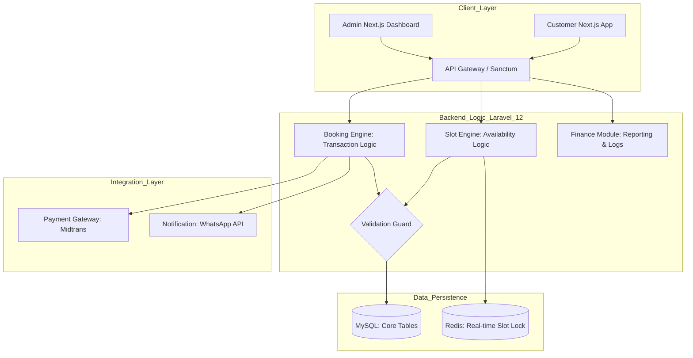
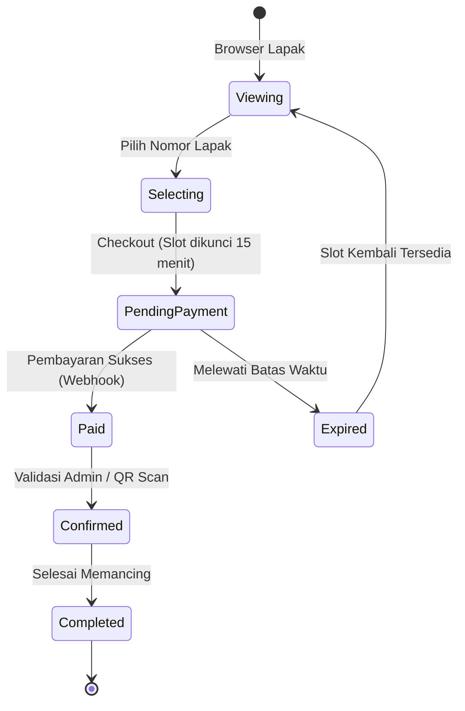

# Project FISHBOOKER - Architecture Blueprint

## 1. Tujuan Sistem

**FISHBOOKER** adalah platform manajemen operasional dan reservasi pemancingan terpadu yang bertujuan untuk:

- **Efisien**: Menghilangkan risiko _double booking_ melalui sistem **Real-time Slot Locking**.
- **Transparan**: Memberikan laporan keuangan otomatis dan akurat bagi pemilik kolam.
- **Modern**: Memberikan pengalaman pengguna yang responsif dengan integrasi peta lapak interaktif.

---

## 2. Prinsip Desain

- **Real-time First**  
  Status lapak harus selalu sinkron antara admin dan pelanggan.

- **Transaction Integrity**  
  Data reservasi dan log keuangan harus diproses dalam satu transaksi database (_atomicity_).

- **Mobile Optimized**  
  UI harus ringan dan mudah digunakan oleh pemancing di lapangan via smartphone.

- **Scalable Infrastructure**  
  Memisahkan backend API dan frontend untuk kemudahan pengembangan di masa depan.

---

## 3. Arsitektur Tingkat Tinggi

## 4. Komponen Utama

### 4.1 Slot Engine (Filter 1 - Availability)

**Tugas:**

- Memvalidasi ketersediaan lapak berdasarkan tanggal dan sesi.
- Mengelola state lapak:
  - `TERSEDIA`
  - `DIBOOKING` (sementara)
  - `TERISI`
- _Locking mechanism_: Mengunci nomor lapak selama proses checkout agar tidak diambil user lain.

---

### 4.2 Booking Engine (Filter 2 - Transaction)

**Tugas:**

- Membuat entri reservasi unik dengan UUID.
- Menghitung total biaya berdasarkan durasi atau tipe lapak.
- Mengatur deadline pembayaran.

---

### 4.3 Financial Module (The Accountant)

**Tugas:**

- Mencatat setiap dana masuk secara otomatis ke tabel `financial_logs`.
- Menghasilkan rekapitulasi harian untuk admin:
  - total omzet
  - jumlah booking
- Validasi status pembayaran dari Payment Gateway.

---

## 5. Booking Lifecycle State Machine

## 6. Risk Management Layer

### Concurrent Booking Protection

Menggunakan Redis / Database Lock untuk mencegah _race condition_ pada satu nomor lapak.

### Payment Verification

Hanya mengubah status menjadi `Paid` melalui verifikasi Webhook resmi dari Payment Gateway, bukan dari client-side.

### Auto-Release System

Job scheduler untuk otomatis membatalkan pesanan yang tidak dibayar tepat waktu.

---

## 7. Data and Storage Strategy

### PostgreSQL / MySQL

Sebagai **source of truth** untuk:

- data user
- nomor lapak
- riwayat booking
- jurnal keuangan

### Redis

Digunakan untuk:

- cache status lapak
- performa akses cepat
- temporary locking saat checkout

---

## 8. Deployment Topology (MVP)

- **Frontend**: Vercel (Next.js 15)
- **Backend API**: Cloud Run / VPS (Laravel 12 + Docker Sail)
- **Database**: Managed SQL Service

---

## 9. Definition of Done (Phase 1)

- User bisa melihat denah lapak secara real-time.
- Sistem berhasil mengunci lapak saat masuk halaman pembayaran.
- Admin bisa melihat total pendapatan harian di dashboard.
- Notifikasi WhatsApp terkirim otomatis saat status berubah menjadi `Paid`.
