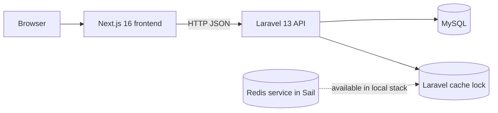

# FishBooker Architecture

Last reviewed: 2026-04-21

## System Summary

FishBooker is a monorepo with two runtime applications:

- `backend/`: Laravel 13 API
- `frontend/`: Next.js 16 application

The current product is an MVP for slot discovery, token-based login, admin slot management, and booking holds that prevent double booking for 15 minutes.

## Current Architecture

## Backend Modules in Code

### Authentication

- Login endpoint returns a Sanctum token
- Admin authorization is enforced by `EnsureUserIsAdmin`
- Breeze web auth routes also exist for registration, password reset, and logout

Key files:

- `backend/app/Http/Controllers/Api/AuthController.php`
- `backend/app/Http/Middleware/EnsureUserIsAdmin.php`
- `backend/routes/api.php`
- `backend/routes/auth.php`

### Slot management

- Public slot list endpoint
- Admin slot create, update, and delete endpoints
- Slot status enum is currently stored in the `slots` table

Key files:

- `backend/app/Http/Controllers/Api/SlotController.php`
- `backend/app/Http/Requests/Api/StoreSlotRequest.php`
- `backend/app/Http/Requests/Api/UpdateSlotRequest.php`
- `backend/app/Models/Slot.php`

### Booking flow

- Authenticated booking creation
- Authenticated booking history lookup
- Atomic row lock on the selected slot with `lockForUpdate()`
- Application-level hold using `Cache::lock(...)`
- Automatic cancellation of expired pending holds for the same slot

Key files:

- `backend/app/Http/Controllers/Api/BookingController.php`
- `backend/app/Http/Requests/Api/StoreBookingRequest.php`
- `backend/app/Models/Booking.php`

## Frontend Modules in Code

The frontend currently ships one public page that combines discovery, login, and booking.
It also ships one admin route for slot operations and one authenticated user booking history route.

Implemented UI pieces:

- `frontend/app/page.tsx`: homepage and data fetch
- `frontend/app/admin/slots/page.tsx`: admin slot route entry
- `frontend/app/bookings/page.tsx`: authenticated booking history route entry
- `frontend/components/AuthHeader.tsx`: login dialog and session display
- `frontend/components/InteractivePondSection.tsx`: slot selection shell
- `frontend/components/PondMap.tsx`: clickable slot map
- `frontend/components/SlotCard.tsx`: slot detail and booking modal
- `frontend/features/admin-slots/api/adminSlotsApi.ts`: admin API adapter
- `frontend/features/admin-slots/components/AdminSlotsPageClient.tsx`: admin container
- `frontend/features/admin-slots/components/AdminSlotFormDialog.tsx`: create and edit dialog
- `frontend/features/bookings/components/BookingHistoryPageClient.tsx`: booking history container
- `frontend/lib/api.ts`: API client for slots, login, and booking
- `frontend/lib/auth-session.ts`: client session and cookie persistence
- `frontend/lib/auth-server.ts`: server-side cookie reader for route gating
- `frontend/proxy.ts`: request-time route protection for admin and booking pages

Analytics, payment, and broader booking operations are still missing.

## Runtime Flow

### Read slots

1. Next.js calls `GET /api/v1/slots`
2. Laravel returns all slot rows
3. Frontend renders map and detail card

### Login

1. User opens the login dialog
2. Frontend calls `POST /api/v1/auth/login`
3. Sanctum token is stored in `sessionStorage`
4. Subsequent booking requests send the bearer token

### Create booking hold

1. User confirms a slot booking
2. Frontend calls `POST /api/v1/bookings`
3. Backend acquires a short cache lock for the slot
4. Backend opens a database transaction and locks the slot row
5. Backend cancels expired pending holds for the same slot
6. If an active hold exists for another user, the request fails with `SLOT_LOCKED`
7. Otherwise a new `PENDING` booking is created with `expires_at = now + 15 minutes`
8. Slot status is updated to `DIBOOKING`

### Manage slots from admin UI

1. Admin opens `/admin/slots`
2. Frontend reads the stored session and checks for role `ADMIN`
3. Frontend reads slot inventory from `GET /api/v1/slots`
4. Create, update, and delete actions call the admin API endpoints with the bearer token
5. Backend remains the final authority through Sanctum auth and admin middleware

### View booking history

1. Logged-in user opens `/bookings`
2. Next.js checks the cookie-backed auth session in `proxy.ts` and again in the server route
3. Frontend calls `GET /api/v1/bookings/me`
4. Backend returns only bookings owned by the authenticated user, including slot details
5. Expired pending bookings for that user are normalized to `CANCELLED`

## State Model in Code

### Slot status

- `TERSEDIA`
- `DIBOOKING`
- `PERBAIKAN`

### Booking status

- `PENDING`
- `SUCCESS`
- `CANCELLED`

`SUCCESS` exists at the schema level but there is no payment or completion flow that sets it yet.

## Health and Operations

- Laravel health endpoint: `GET /up`
- Local infrastructure: Sail app, MySQL, Redis, Mailpit
- Automated domain-specific scheduler or booking cleanup command is not implemented yet

## Known Gaps Between Architecture Intent and Code

These items are planned or referenced elsewhere, but not implemented today:

- Payment gateway integration
- Webhook processing
- Financial journal tables
- Reporting pipeline
- Admin analytics dashboard
- Dedicated service and repository layers for booking and slot domains

## Design Decision

FishBooker currently behaves as a modular monolith split into a Laravel API and a Next.js client.
This matches the accepted direction in `docs/architecture-decision-record.md`, but the code is still in an early stage and has not fully separated controller and service responsibilities yet.
