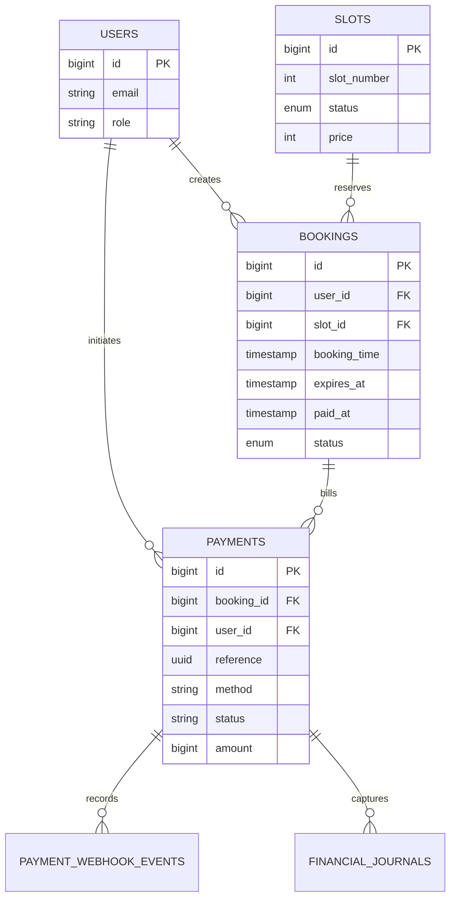

# FishBooker Data Model

Last reviewed: 2026-04-22

## Scope

This document describes the database structures that are present in the Laravel migrations today, including payment, webhook, and finance journal tables that are now part of the implemented flow.

## Primary Application Tables

### `users`

Purpose: application users for auth and role checks.

Key columns:

- `id` bigint primary key
- `name` string
- `email` string unique
- `email_verified_at` timestamp nullable
- `password` string
- `role` enum: `ADMIN`, `PELANGGAN`
- `remember_token`
- `created_at`, `updated_at`

### `slots`

Purpose: fish pond slot inventory and current availability state.

Key columns:

- `id` bigint primary key
- `slot_number` integer
- `status` enum: `TERSEDIA`, `DIBOOKING`, `PERBAIKAN`
- `price` integer
- `created_at`, `updated_at`

Notes:

- `slot_number` is not unique yet at the schema level.
- Slot status is updated by booking, payment settlement, and admin maintenance flows.

### `bookings`

Purpose: booking holds and booking lifecycle records.

Key columns:

- `id` bigint primary key
- `user_id` foreign key to `users.id`
- `slot_id` foreign key to `slots.id`
- `booking_time` timestamp
- `expires_at` timestamp nullable
- `paid_at` timestamp nullable
- `status` enum: `PENDING`, `SUCCESS`, `CANCELLED`
- `created_at`, `updated_at`

Indexes:

- composite index on `status, expires_at`
- composite index on `user_id, status`

Notes:

- `PENDING` means the hold still exists and payment has not settled.
- `SUCCESS` is now set by the payment settlement flow.
- Expired pending holds are normalized to `CANCELLED`.

### `payments`

Purpose: one or more payment attempts associated with a booking.

Key columns:

- `id` bigint primary key
- `booking_id` foreign key to `bookings.id`
- `user_id` foreign key to `users.id`
- `provider` string
- `method` string
- `status` string
- `amount` unsigned bigint
- `currency` string
- `reference` uuid unique
- `gateway_reference` string nullable unique
- `checkout_url` string nullable
- `expires_at` timestamp nullable
- `paid_at` timestamp nullable
- `metadata` json nullable
- `created_at`, `updated_at`

Indexes:

- composite index on `booking_id, status`
- composite index on `user_id, status`
- composite index on `provider, status`

Notes:

- The local implementation uses provider `MANUAL`.
- Supported methods in code today are `MANUAL_TRANSFER` and `CASH`.
- Statuses observed in code today are `PENDING`, `PAID`, `FAILED`, `EXPIRED`, and `CANCELLED`.

### `payment_webhook_events`

Purpose: idempotent audit log for inbound payment webhook events.

Key columns:

- `id` bigint primary key
- `payment_id` foreign key nullable to `payments.id`
- `provider` string
- `event_id` string
- `event_type` string
- `signature_hash` string nullable
- `payload` json
- `processed_at` timestamp nullable
- `created_at`, `updated_at`

Constraints:

- unique key on `provider, event_id`

Notes:

- Duplicate webhook events are ignored after the first successful insert.
- The stored payload allows replay analysis without exposing raw secrets.

### `financial_journals`

Purpose: immutable finance ledger rows derived from successful payment capture.

Key columns:

- `id` bigint primary key
- `booking_id` foreign key to `bookings.id`
- `payment_id` foreign key to `payments.id`
- `entry_type` string
- `amount` unsigned bigint
- `currency` string
- `description` string
- `recorded_at` timestamp
- `metadata` json nullable
- `created_at`, `updated_at`

Constraints:

- unique key on `payment_id, entry_type`

Notes:

- The implemented entry type today is `PAYMENT_CAPTURED`.
- Application code treats the table as append-only and does not update or delete journal rows during normal flows.

## Authentication and Framework Tables

### `personal_access_tokens`

Purpose: Sanctum token storage for API auth.

### `password_reset_tokens`

Purpose: password reset flow from Breeze.

### `sessions`

Purpose: Laravel session storage when session-backed flows are used.

### `cache` and `cache_locks`

Purpose: cache storage and atomic lock support when the selected cache driver uses database tables.

### `jobs`, `job_batches`, `failed_jobs`

Purpose: queue support and failed job tracking.

## Relationships

## Seed Data

Current seeders create:

- one default user from `DatabaseSeeder`
- five example slots from `SlotSeeder`

The seeded slots intentionally include mixed statuses so the frontend can show available, held, and maintenance states.

## Operational Notes

- Payment settlement writes both `payments.paid_at` and `bookings.paid_at`.
- Failed or expired payment outcomes cancel the booking and can release the slot back to `TERSEDIA`.
- The admin dashboard and CSV export read from `payments` and `financial_journals`.
