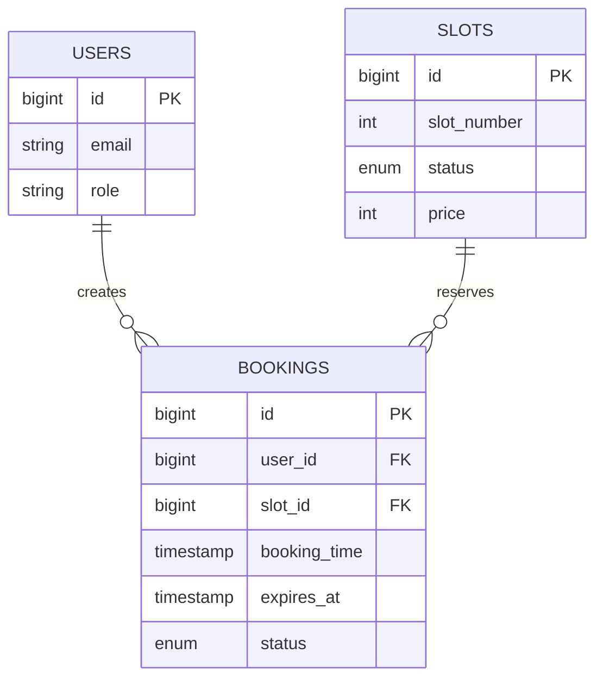

# FishBooker Data Model

Last reviewed: 2026-04-21

## Scope

This document describes the database structures that are present in the Laravel migrations today.
Older references to finance, analytics, and payment tables are product targets, not implemented schema.

## Primary Application Tables

### `users`

Purpose: application users for auth and role checks.

Key columns:

- `id` bigint primary key
- `name` string
- `email` string unique
- `email_verified_at` timestamp nullable
- `password` string
- `role` enum: `ADMIN`, `PELANGGAN`
- `remember_token`
- `created_at`, `updated_at`

Notes:

- Role-based authorization for admin endpoints depends on `role`.
- Seeder creates one default user with email `test@example.com`.

### `slots`

Purpose: fish pond slot inventory and current availability state.

Key columns:

- `id` bigint primary key
- `slot_number` integer
- `status` enum: `TERSEDIA`, `DIBOOKING`, `PERBAIKAN`
- `price` integer
- `created_at`, `updated_at`

Notes:

- `slot_number` is not unique yet at the schema level.
- Slot status is updated directly during booking and admin maintenance flows.

### `bookings`

Purpose: booking holds and booking lifecycle records.

Key columns:

- `id` bigint primary key
- `user_id` foreign key to `users.id`
- `slot_id` foreign key to `slots.id`
- `booking_time` timestamp
- `expires_at` timestamp nullable
- `status` enum: `PENDING`, `SUCCESS`, `CANCELLED`
- `created_at`, `updated_at`

Indexes:

- index on `expires_at`
- composite index on `slot_id, status`

Notes:

- Current code creates `PENDING` bookings only.
- Expired pending holds are converted to `CANCELLED` during the next booking attempt for the same slot.
- There is no separate payment record yet.

## Authentication and Framework Tables

### `personal_access_tokens`

Purpose: Sanctum token storage for API auth.

### `password_reset_tokens`

Purpose: password reset flow from Breeze.

### `sessions`

Purpose: Laravel session storage when session-backed flows are used.

### `cache` and `cache_locks`

Purpose: cache storage and atomic lock support when the selected cache driver uses database tables.

### `jobs`, `job_batches`, `failed_jobs`

Purpose: queue support and failed job tracking.

## Relationships

## Seed Data

Current seeders create:

- one default user from `DatabaseSeeder`
- five example slots from `SlotSeeder`

The seeded slots intentionally include mixed statuses so the frontend can show available, held, and maintenance states.

## Not Implemented Yet

The following entities appear in older planning documents but do not exist in migrations today:

- `financial_journals`
- `daily_summaries`
- `user_activity_logs`
- payment gateway reference tables
- site configuration tables

If those features are added later, update this document and the migrations in the same change.
